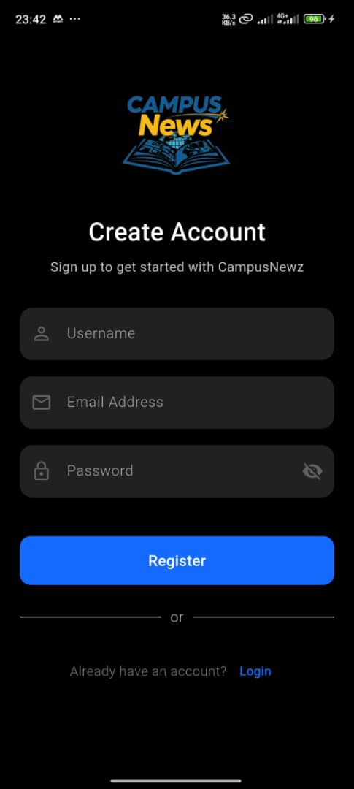
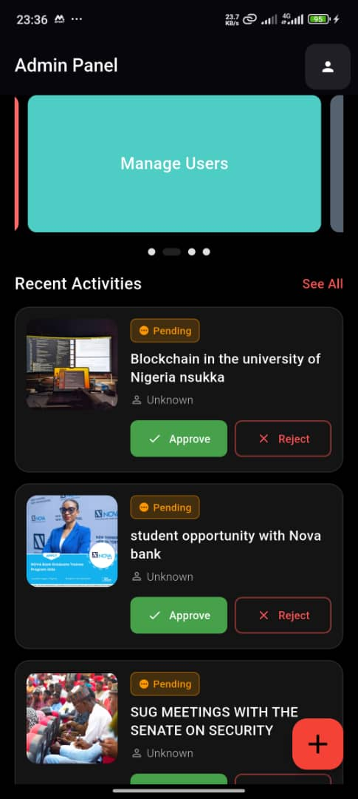
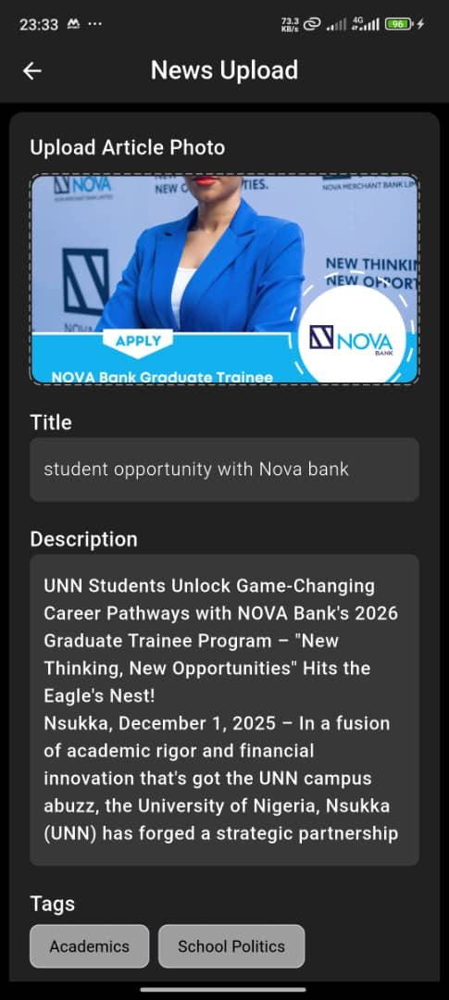

# 🎓 Campus News – University Mobile App

CampusNews is a modern mobile application designed to improve communication, access to resources, and student engagement within the university environment.  
The app provides students with a centralized platform for academic updates, announcements, and campus-related services.

---

## 📱 App Preview

> Screenshots of the application UI

<p align="center">
   
  |
  
  |
  
  |
   
  |
    
  |
</p>

---

## 🚀 Features

- 🔐 Secure Authentication (Login & Signup)
- 💬 Real-time News and Update
- 📰 University Announcements & News
- ⚡ Smooth Animations & Modern UI
- 📱 Cross-platform (Android & iOS)

---

## 🏗️ App Architecture

The app follows a **clean and scalable architecture** to ensure maintainability and performance.


---

## 🛠️ Tech Stack

- **Frontend:** Flutter (Dart)
- **Backend:** Firebase
- **Authentication:** Firebase Auth
- **Database:** Firestore
- **Design:** Material 3

---

## 📦 Installation

1. Clone the repository:
   ```bash
   git clone https://github.com/Elvisnc9/University-of-Nigeria-News-APP.git
